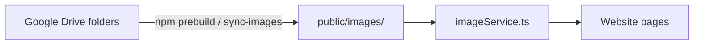

# Image Sources

This document describes how wedding photos are sourced and served.

## Overview

The website **always serves images from `public/images/`** at runtime. Google Drive is optional and used only as a **build-time CMS** — photos are synced to `public/images/` before each build.



## Supported Modes

| `IMAGE_SOURCE_TYPE` | Build behavior | Runtime behavior |
|---------------------|----------------|------------------|
| `local` (default) | Skips Drive sync | Reads `public/images/` |
| `google-drive` | Syncs from Drive | Reads `public/images/` |
| `direct-google-drive` | Same as `google-drive` (legacy alias) | Reads `public/images/` |

## Local Images (Default)

No extra configuration. Place images in:

- `public/images/hero-album/` — hero slideshow
- `public/images/gallery/` — gallery section
- `public/images/throwback/` — story throwback photos
- `public/images/prenup/` — prenup photos
- `public/images/dress-code/` — dress code mood board

```env
IMAGE_SOURCE_TYPE=local
```

Run `npm run optimize-images` after adding JPEG/PNG files to convert them to WebP.

## Google Drive Images (Build-Time Sync)

Use Google Drive to manage photos without committing large binaries to git.

### Setup

1. Create a Google Cloud service account with Drive API enabled
2. Share your Drive folders with the service account email (Viewer access)
3. Configure environment variables (see [GOOGLE_DRIVE_SETUP.md](GOOGLE_DRIVE_SETUP.md))

```env
IMAGE_SOURCE_TYPE=google-drive
GOOGLE_SERVICE_ACCOUNT_KEY='{"type":"service_account",...}'
GOOGLE_DRIVE_FOLDER_ID=your-main-folder-id
```

### Folder structure

**Option A — single parent folder with subfolders:**

```
Wedding Photos/
├── hero-album/
├── gallery/
├── throwback/
├── prenup/
└── dress-code/
```

Set only `GOOGLE_DRIVE_FOLDER_ID` to the parent folder ID. Subfolders are discovered by name.

**Option B — separate folder per collection:**

```env
GOOGLE_DRIVE_HERO_ALBUM_FOLDER_ID=...
GOOGLE_DRIVE_GALLERY_FOLDER_ID=...
GOOGLE_DRIVE_THROWBACK_FOLDER_ID=...
GOOGLE_DRIVE_PRENUP_FOLDER_ID=...
GOOGLE_DRIVE_DRESS_CODE_FOLDER_ID=...
```

### Commands

```bash
npm run test-drive    # Validate Drive credentials and list images
npm run sync-images   # Manual sync (also runs automatically before build)
npm run build         # prebuild → sync-images → optimize-images → next build
```

### How sync works

1. Lists image files in each configured Drive folder
2. Downloads only new or changed files (compares modification time)
3. Removes local files no longer present in Drive
4. `optimize-images` converts JPEG/PNG to WebP during prebuild

Sync failures do not block the build — existing local images are used.

## Code Reference

| Path | Role |
|------|------|
| `src/lib/googleDrive/` | Shared Drive API module (build-time only) |
| `scripts/sync-images.ts` | Build-time sync script |
| `scripts/optimize-images.ts` | WebP conversion |
| `src/services/imageService.ts` | Runtime image loading from `public/images/` |
| `src/services/providers/localProvider.ts` | Local filesystem provider |

## RSVP Note

RSVP uses a Google Forms **link** in `config/wedding.json`. Form responses are **not** synced into the codebase.

## Related Docs

- [GOOGLE_DRIVE_SETUP.md](GOOGLE_DRIVE_SETUP.md) — service account and folder setup
- [GOOGLE_DRIVE_IMPLEMENTATION.md](GOOGLE_DRIVE_IMPLEMENTATION.md) — technical implementation details
- [CACHE_MANAGEMENT.md](CACHE_MANAGEMENT.md) — CI image caching
